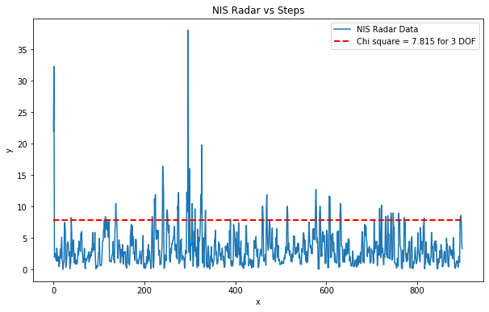
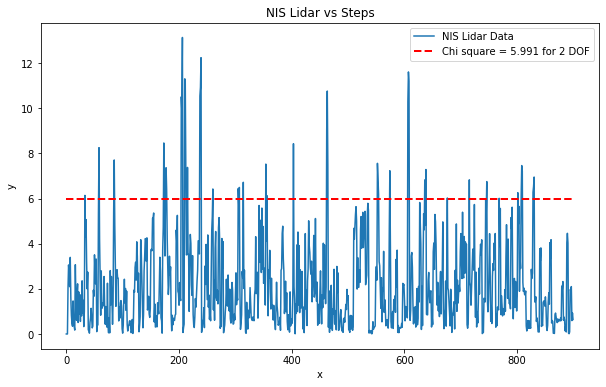

# SFND_Unscented_Kalman_Filter
Sensor Fusion UKF Highway Project 

In this project an Unscented Kalman Filter is implemented to  estimate and track the state of multiple cars on a highway using noisy lidar and radar measurements. Passing the project requires obtaining RMSE values that are lower that the tolerance outlined in the project rubric. A non linear CTRV motion model is used to model the steering and lane changing of Cars on highway. 

The main program can be built and ran by doing the following from the project top directory.

1. mkdir build
2. cd build
3. cmake ..
4. make
5. ./ukf_highway

Note that the programs that need to be written to accomplish the project are src/ukf.cpp, and src/ukf.h

The program main.cpp has already been filled out, but feel free to modify it.

`main.cpp` is using `highway.h` to create a straight 3 lane highway environment with 3 traffic cars and the main ego car at the center.
The viewer scene is centered around the ego car and the coordinate system is relative to the ego car as well. The ego car is green while the
other traffic cars are blue. The traffic cars will be accelerating and altering their steering to change lanes. Each of the traffic car's has
it's own UKF object generated for it, and will update each indidual one during every time step.

The red spheres above cars represent the (x,y) lidar detection and the purple lines show the radar measurements with the velocity magnitude along the detected angle. The Z axis is not taken into account for tracking, so you are only tracking along the X/Y axis.

---

## Other Important Dependencies
* cmake >= 3.5
  * All OSes: [click here for installation instructions](https://cmake.org/install/)
* make >= 4.1 (Linux, Mac), 3.81 (Windows)
  * Linux: make is installed by default on most Linux distros
  * Mac: [install Xcode command line tools to get make](https://developer.apple.com/xcode/features/)
  * Windows: [Click here for installation instructions](http://gnuwin32.sourceforge.net/packages/make.htm)
* gcc/g++ >= 5.4
  * Linux: gcc / g++ is installed by default on most Linux distros
  * Mac: same deal as make - [install Xcode command line tools](https://developer.apple.com/xcode/features/)
  * Windows: recommend using [MinGW](http://www.mingw.org/)
 * PCL 1.2

## Basic Build Instructions

1. Clone this repo.
2. Make a build directory: `mkdir build && cd build`
3. Compile: `cmake .. && make`
4. Run it: `./ukf_highway`

## Discussion

UKF algorithm was implemented as shown in the class practice problem.

To pass the project the RMSE values should not cross the threshold values set in `highway.h`. Also the solution should converge within 1.0e6 seconds of time. I observed, for the solution to converge faster, the value of P - uncertainty co-variance matrix should be properly initialized. I tried initializing P as an identity matrix, but the solution didn't converge fast enough to pass the timing criteria. Hence later I initialized the P matrix with variance value of 0.15*0.15 = 0.0225 for the yaw and yaw rate .This helped in faster convergence. Also the solution does not converge to required RMSE values witihin the  timing criteria when either of the LIdar or radar measurements are disabled. 

I modified `highway.h` and `main.cpp` so as to write the NIS Radar and NIS Lidar data to their respective text files for further analysis.  NIS vs steps  Plots are used to check the consistency of UKF results. Tried different process noise co-variance values for `std_a_` and `std_yawdd_`. Finally, got consistent results with `std_a_ = 3;` and `std_yawdd_ = 2;`, as you can see in the plots below.

